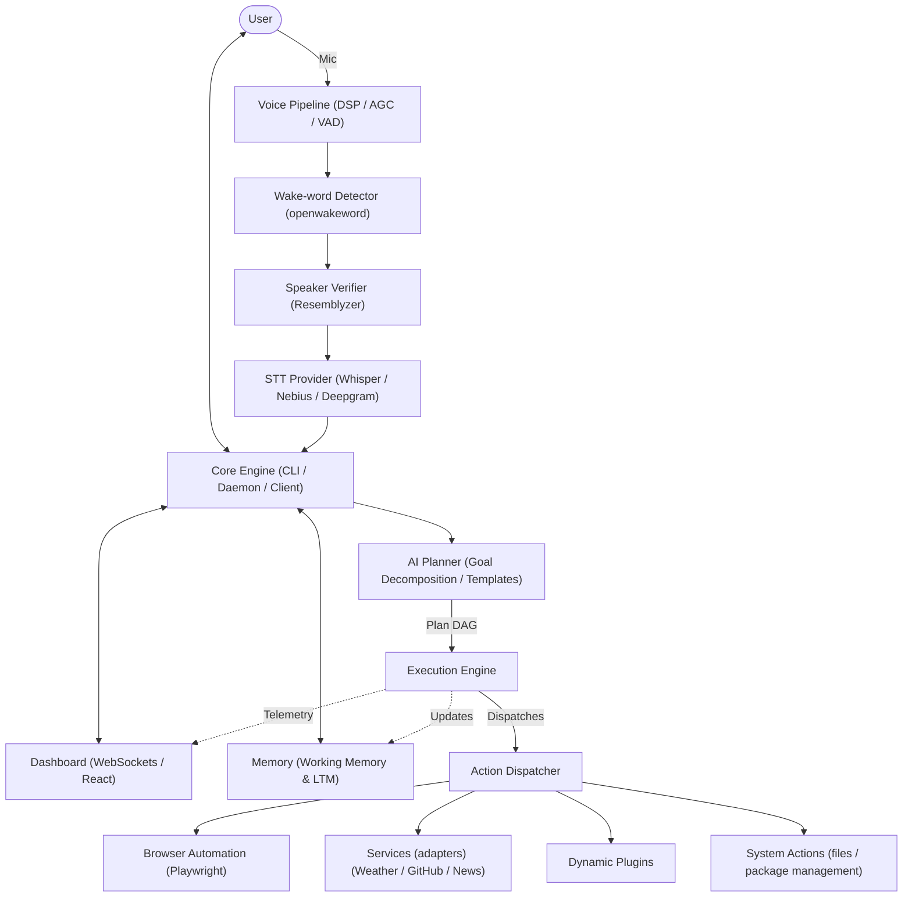

# Nova AI Desktop Assistant

[](https://github.com/abhishek481828/Nova/releases)
[](LICENSE)
[](https://www.python.org/)
[](https://nixos.org/)

Nova is a highly modular, next-generation cognitive desktop assistant built with local and cloud-based AI capabilities. Featuring an advanced real-time voice pipeline with speaker verification, resilient browser automation, a structured planning/reasoning engine, and a live web telemetry dashboard, Nova acts as a powerful orchestrator for your local workflows.

### Who It Is For
Nova is designed for developers, power users, and system administrators—particularly those on Linux-based environments like NixOS—who want a customizable, voice-enabled assistant that can run tasks locally, automate browser actions, and interact safely with their system without raw, unsafe shell injection fallbacks.

### Problems It Solves
1. **Unsafe Command Execution**: Traditional AI assistants execute generated shell scripts directly. Nova translates requests into structured steps with explicit dependencies and parameter boundaries.
2. **Environmental Noise & Speaker Security**: Standard wake-word engines trigger on any voice and suffer in noisy rooms. Nova uses a digital signal processing (DSP) pipeline coupled with speaker-verification profile matching.
3. **Brittle Browser Automation**: Custom automation scripts break easily on page updates. Nova's Playwright integration abstracts interactions into reusable playbooks with tab recovery safety loops.
4. **Opaque Telemetry**: Running terminal-based daemons makes tracking background tasks difficult. Nova streams hardware metrics and execution timelines directly to a WebSocket-powered web dashboard.

---

## Features

### 🎙 Voice Intelligence
- **DSP Audio Pipeline**: Real-time microphone input preprocessing featuring an RNNoise neural denoiser, a Butterworth high-pass filter (AC/fan hum removal), Automatic Gain Control (AGC), and WebRTC Voice Activity Detection (VAD).
- **Secure Wake-Word Engine**: Passive listening powered by `openwakeword` checking a rolling audio buffer with adaptive noise-floor threshold scaling.
- **Biometric Speaker Verification**: Integrated profile verification via `Resemblyzer` ensures only registered users can execute plan operations.
- **Multi-Provider STT & TTS**: Automatic routing for Speech-to-Text (Deepgram, Groq, OpenAI, Nebius, or local offline Faster-Whisper fallback) and Text-to-Speech (edge-tts and ElevenLabs).

### 🌐 Browser Automation
- **Playwright-Driven Execution**: Headless or headed Chromium browser automation supporting complex operations (page clicks, text entry, credential injection).
- **CDP Linkage & Page Safety**: Automated browser verification filters out unsafe targets (e.g., `chrome-extension://` pages) and links securely over Chromium's DevTools Protocol (CDP).
- **Resilient Tab Recovery**: Handles target window drops and disconnects dynamically during active task steps.

### 🧠 AI Planning & Goal Decomposition
- **DAG Execution Planner**: Goal decomposition using semantic matching against 15 framework templates (e.g., FastAPI, React, Node.js, Flask, Django).
- **9-Phase Structure**: Organizes every project plan into a 9-phase skeleton: `Project Setup`, `Environment Setup`, `Dependency Installation`, `Project Structure`, `Source Code Generation`, `Configuration`, `Validation`, `Execution`, and `Verification`.
- **Precondition Evaluation**: Inspects system compilers, libraries, and existing files, dynamically injecting prerequisites before committing a plan.
- **Artifact-Driven Dependency Mapping**: Maps step dependencies using explicit artifact producers and consumers instead of brittle description matching.

### 🖥 Desktop Automation
- **Subprocess Isolation**: System operations (file creation, package installation, configurations) are run as discrete argument lists using safe subprocess operations.
- **Audio Output Manipulation**: Integrates with Linux mixer subsystems (e.g. `wpctl`) to adjust volume, mute default sinks during voice recordings, and play confirmation chimes.

### 📊 Telemetry Dashboard
- **Live Diagnostics**: Web-based diagnostic interface showing microphone health, STT/TTS statuses, browser states, and overall device status.
- **Timeline Streaming**: Publishes real-time execution steps, latency profiles, noise-floor measurements, and memory structures over WebSockets.

### 🔌 Plugin Architecture
- **Dynamic Skill Registry**: Dynamic runtime action loader allowing new Python modules to register custom capabilities with the Action Dispatcher.

### ⚙ Configuration
- **Unified Environment Setup**: Settings managed via `.env` files with overriding `NOVA_` prefixed system variables.
- **Adaptive Threshold Tuning**: Heuristic auto-tuning updates VAD noise thresholds and silence timeouts based on real-time room SNR.

### 🧪 Robust Test Suite
- **Comprehensive Unit Testing**: High-coverage test suite verifying DSP operations, state machine transitions, thread-safe memory, and planner execution.

---

## Screenshots

### Dashboard
```
[================================================================]
[                        LIVE DASHBOARD                          ]
[  [Microphone: Healthy] [Wake Engine: Ready] [STT: Deepgram]   ]
[  [CPU Usage: 14%]      [Active Plan: Flask Site Setup (40%)]   ]
[                                                                ]
[  > Step 3/9: "Generate index.html" ......... [COMPLETED]       ]
[  > Step 4/9: "Configure environment variables" [RUNNING]       ]
[================================================================]
```
*(Image Placeholder: `docs/images/dashboard_screenshot.png`)*

### Voice Mode
```
[================================================================]
[                       VOICE COMMAND WINDOW                     ]
[  👂 Waiting for "Hey Nova"...                                 ]
[  🎤 Heard: "build a react app and start the server"           ]
[  👤 Speaker Verified: User profile matches (similarity: 0.84)  ]
[  ▶ Executing react-skeleton generation...                      ]
[================================================================]
```
*(Image Placeholder: `docs/images/voice_flow.png`)*

### Browser Automation
```
[================================================================]
[                    PLAYWRIGHT AUTOMATION RUN                   ]
[  [Chromium] Navigating to https://github.com/login...          ]
[  [Chromium] Injecting credentials safely...                    ]
[  [Chromium] Tab verification check: PASSED                    ]
[================================================================]
```
*(Image Placeholder: `docs/images/browser_automation.png`)*

### Terminal
```
[================================================================]
[                      NOVA TEXT INTERFACE                       ]
[  nova --text                                                   ]
[  Nova > create a fastapi app in ./test-api                     ]
[  Planner: Generated plan with 8 executable steps.             ]
[  Planner: Critical path estimated duration: 12.5 seconds.     ]
[  Approval: Execute plan? (y/N): y                             ]
[================================================================]
```
*(Image Placeholder: `docs/images/terminal_cli.png`)*

---

## Demo
Watch the comprehensive walk-through demonstrating Nova's voice interaction, real-time telemetry, and structured code generation:

[](https://youtube.com/demo-placeholder)

---

## Architecture

Nova uses a decoupled cognitive architecture where audio streams, planners, system subsystems, and live dashboards interact asynchronously.



### Component Interaction:
1. **Voice Pipeline**: Converts sound device streams into clean, validated text transcriptions by cascading DSP filters, wake-word detection, speaker verification, and Speech-to-Text.
2. **Core Engine**: Orchestrates execution state, monitors thread health, reads configuration parameters, and routes the transcribed query to the Planner.
3. **AI Planner**: Decomposes queries into a task DAG, topologically sorting them by artifact dependency, and schedules execution.
4. **Browser**: Coordinates headless Playwright scripts, safely filtering targets and managing session cookies.
5. **Services**: Provides outbound API integrations to CoinGecko, NewsAPI, WeatherAPI, and Telegram bots.
6. **Dashboard**: Evaluates the metrics emitted by the execution loops and displays them on a live telemetry webpage.
7. **Memory**: Working Memory tracks variables and status flags for active execution blocks; Long-Term Memory persists the user profile and habits.
8. **Configuration**: Restricts environment overrides and dynamically updates parameters during run time.

---

## Project Structure

```
.
├── .github/                  # Issue and PR templates
│   ├── ISSUE_TEMPLATE/
│   │   ├── bug_report.md
│   │   └── feature_request.md
│   └── PULL_REQUEST_TEMPLATE.md
├── docs/                     # Guides and architectural documentation
│   ├── architecture.md
│   ├── developer-guide.md
│   ├── installation.md
│   ├── voice-guide.md
│   ├── browser-guide.md
│   ├── testing-guide.md
│   ├── configuration-guide.md
│   ├── release-guide.md
│   ├── VOICE_SETUP.md
│   └── WORKING_MEMORY.md
├── nova/                     # Main source code directory
│   ├── actions/              # Dynamic skill action adapters (e.g. system, volume, browser)
│   ├── adapters/             # Interface adaptors for services
│   ├── ai/                   # AI logic, Ollama integration, and Planner
│   │   └── planner/          # Goal DAG construction and template JSON configurations
│   ├── automation/           # Custom desktop/keyboard automation playbooks
│   ├── browser/              # Playwright manager, tab controllers, and fill wizards
│   │   └── wizards/          # Browser automation setups
│   ├── config/               # Settings parsers, environment loaders, and config templates
│   ├── core/                 # TCP daemon, client, CLI entrypoint, and orchestrator
│   ├── dashboard/            # Telemetry websocket backend server
│   ├── desktop/              # OS-level automation utilities
│   ├── plugins/              # Dynamic run-time action plugin adapters
│   ├── prompts/              # System prompt and summary template files
│   ├── services/             # Third-party client API handlers (News, OCR, Weather, GitHub)
│   ├── utils/                # Helper formatting and system checks
│   └── voice/                # Audio loop pipeline (AGC, VAD, Wake detection, Speaker verification, TTS)
│       └── wizards/          # Voice enrollment and training guides
├── tests/                    # Pytest test suite folders
├── .env.example              # Environment variables template
├── requirements.txt          # Python dependencies
├── requirements-voice.txt    # Voice-specific python packages (audio/STT/TTS)
├── shell.nix                 # Nix environment package manager definition
└── VERSION                   # Release version tracker
```

---

## Installation

### NixOS (Recommended)
Nova is developed primarily for NixOS, offering deterministic dependency configuration.
```bash
# Clone the repository
git clone https://github.com/abhishek481828/Nova.git
cd Nova

# Drop into the pre-configured nix shell containing system libraries (portaudio, ffmpeg, rnnoise, speexdsp)
nix-shell
```

### Generic Linux
On standard Linux distributions (Ubuntu, Fedora, Arch), you must install system dependencies manually before configuring the Python environment.
```bash
# Ubuntu/Debian dependencies
sudo apt-get install ffmpeg portaudio19-dev libsndfile1 mpg123 rnnoise speexdsp nodejs scrot

# Arch Linux dependencies
sudo pacman -S ffmpeg portaudio libsndfile mpg123 rnnoise speex nodejs scrot
```

### Virtual Environment Configuration
Once system dependencies are set, initialize your virtual environment:
```bash
# Setup virtual environment
python -m venv .venv
source .venv/bin/activate

# Install package dependencies
pip install -r requirements.txt -r requirements-voice.txt
```

---

## Quick Start

### 1. Configuration Setup
Create your local environment file:
```bash
cp .env.example .env
```
Open `.env` and configure your API keys (e.g. `GEMINI_API_KEY`, `ELEVENLABS_API_KEY`, `TAVILY_API_KEY`).

### 2. Voice Enrollment
Train the speaker verification subsystem to recognize your voice profile:
```bash
python -m nova.voice.wizards.voice_profile_wizard
```

### 3. Running Nova

#### Voice Mode (Hands-free Wake Loop)
Start the active hands-free wake loop listener:
```bash
# Runs the audio processing loop waiting for "Hey Nova"
python -m nova.main --voice
```

#### Text Mode (CLI Interactive Prompt)
Run the assistant directly in the terminal without voice triggers:
```bash
python -m nova.main --text
```

#### Telemetry Dashboard
Launch the dashboard telemetry backend server to view real-time logs:
```bash
python -m nova.dashboard.backend.server
```

---

## Configuration Reference

- **`.env.example`**: Standard environment variables template indicating required API tokens, URL endpoints, and runtime targets.
- **`VERSION`**: File containing the semantic version string (`1.0.0`).
- **`nova/version.py`**: Resolves local runtime version strings dynamically by querying the `VERSION` file at the root.
- **`nova/config.py`**: Standardizes global configuration settings, environment fallback rules, and AI parameters.
- **`nova/voice/config.py`**: Controls DSP settings, noise suppression toggles, RMS levels, silence timeouts, confidence fusion weights, and speaker verify variables.

---

## Testing

Nova uses `pytest` for automated test verification.

### Running Pytest
To run the test suite locally within your environment:
```bash
PYTHONPATH=. pytest
```
If using NixOS, run pytest isolated inside the nix-shell environment:
```bash
nix-shell --run "PYTHONPATH=. .venv/bin/pytest"
```

### Running CI
Nova runs automated test validations on every push/merge to the `main` branch.

### Test Status
All **319 unit, integration, and concurrency tests** are currently passing successfully:
```
======================= 319 passed, 3 warnings in 53.29s =======================
```

---

## Documentation Links

For deeper subsystem blueprints and integration manuals, consult the documentation:
- 📖 [Architecture Blueprint](docs/architecture.md)
- 💻 [Developer Conventions & Conventions](docs/developer-guide.md)
- 🚀 [Detailed Installation Manual](docs/installation.md)
- 🎙️ [Voice Subsystem Reference](docs/voice-guide.md)
- 🌐 [Playwright Browser Guide](docs/browser-guide.md)
- 🧪 [Testing Instructions](docs/testing-guide.md)
- ⚙️ [Configuration Variables Guide](docs/configuration-guide.md)
- 🏷️ [Release Procedures](docs/release-guide.md)

---

## Roadmap

- **v1.1.0**: Memory optimization, SQLite-based RAG support.
- **v1.2.0**: Multimodal vision integrations.
- **v2.0.0**: Distributed local agent swarm control.

---

## Contributing
Please review our [CONTRIBUTING.md](CONTRIBUTING.md) guide, follow the [CODE_OF_CONDUCT.md](CODE_OF_CONDUCT.md), and report vulnerabilities via the instructions in [SECURITY.md](SECURITY.md).

---

## License
This project is licensed under the terms of the MIT License. See [LICENSE](LICENSE) for details.

---

## Contact
- **Developer**: Abhishek Das
- **GitHub**: [@abhishek481828](https://github.com/abhishek481828)
- **Repository**: [abhishek481828/Nova](https://github.com/abhishek481828/Nova)
- **Issues**: [GitHub Issue Tracker](https://github.com/abhishek481828/Nova/issues)
