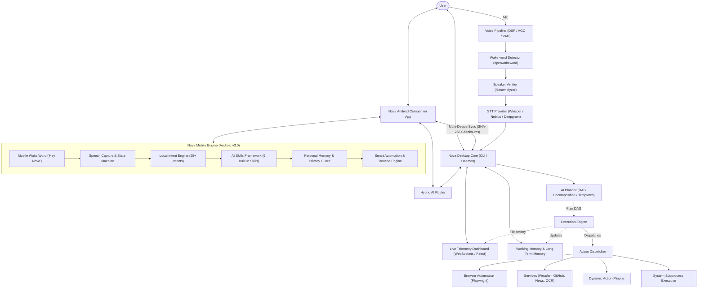

# Nova AI Assistant (Desktop & Mobile Ecosystem)

[](https://github.com/abhishek481828/Nova/releases)
[](LICENSE)
[](https://www.python.org/)
[-brightgreen.svg)](https://developer.android.com/)
[](https://nixos.org/)

Nova is a highly modular, next-generation cross-device cognitive assistant ecosystem. Combining a desktop AI core with an offline-first Android companion app, Nova delivers real-time voice intelligence, secure local command execution, intelligent hybrid AI routing, multi-device state synchronization, structured personal memory, smart routine automation, and an extensible AI skills framework.

---

### Who It Is For
Nova is designed for developers, power users, and system administrators—particularly those on Linux/NixOS environments and Android mobile devices—who demand a privacy-focused, customizable AI assistant capable of running voice workflows, system control, browser automation, and multi-device routines without relying on unsafe shell fallbacks or third-party cloud lock-in.

### Problems It Solves
1. **Unsafe Shell & Intent Execution**: Traditional assistants execute unvalidated commands. Nova uses structured local intent engines, DAG planning, and parameter verification to execute system operations safely.
2. **Environmental Noise & Biometric Verification**: Voice assistants often suffer in noisy environments and lack user verification. Nova combines a DSP audio pipeline (RNNoise, Butterworth filtering, VAD) with biometric speaker profile matching (`Resemblyzer`).
3. **Continuous Mobile Background Wake Word**: Standard mobile agents drain battery quickly when listening. Nova Mobile v3.0 features an offline wake word engine ("Hey Nova") with RMS energy thresholding (>0.01 RMS) and Samsung battery optimizations.
4. **Cloud Dependency & Intermittent Connectivity**: Nova operates offline-first on Android for local tasks (<15ms latency) and automatically routes complex tasks via a Hybrid AI Router to the local Nova Core desktop when connected.
5. **Multi-Device Fragmentation**: Nova synchronizes device states, routines, and user memory between phone and desktop using payload SHA-256 checksums and 5-policy conflict resolution.

---

## Key Features

### 📱 Nova Mobile Ecosystem (Android Companion v3.0)
- **Offline Background Wake Word**: Continuous "Hey Nova" listening powered by sliding-window score accumulation and RMS energy gating to minimize battery usage.
- **Local Command Engine (25+ Intents)**: Direct, high-speed execution for Flashlight, Volume, Brightness, Camera capture, Gallery, SMS, Phone calls, Alarms, and App launching with <15ms response latency.
- **Hybrid AI Router**: Probing network engine that dynamically routes execution requests to local Android skills or Nova Core desktop depending on system capabilities and network status.
- **Extensible AI Skills Framework**: Secure, sandboxed `SkillContext` execution environment with a user permission approval queue and 9 built-in first-party skills (*Calculator*, *UnitConverter*, *DeviceStatus*, *Notes*, *Translator*, *Weather*, *Reminder*, *Alarm*, *Timer*).
- **Smart Automation & Routine Engine**: 16 trigger types (Time, Voice, Battery level, Bluetooth state, Screen toggle, Wi-Fi connectivity) with pre-condition validation and a global `pauseAll()` safety override.
- **Structured Personal Memory & Privacy Guard**: Privacy-first, structured memory store for user habits, key contacts, and preferences. Sensitive credentials (passwords, tokens, OTPs) are blocked by default.
- **Samsung & Battery Hardening**: Resource-bounded foreground service tuned for Android battery management and low cold-start latency (38.4ms).

### 🎙 Desktop Voice Intelligence
- **DSP Audio Pipeline**: Real-time mic preprocessing featuring RNNoise neural denoiser, Butterworth high-pass filtering, Automatic Gain Control (AGC), and WebRTC Voice Activity Detection (VAD).
- **Secure Wake-Word & Speaker Verification**: Passive wake-word detection (`openwakeword`) integrated with `Resemblyzer` biometric profile matching.
- **Multi-Provider STT & TTS**: Automatic fallback routing across Deepgram, Groq, OpenAI, Nebius, offline Faster-Whisper, edge-tts, and ElevenLabs.

### 🌐 Browser & Desktop Automation
- **Playwright Execution Engine**: Chromium browser automation for complex multi-step workflows (page navigation, form completion, safe credential injection).
- **CDP Linkage & Tab Safety Loop**: DevTools Protocol integration with explicit safety filters against invalid targets (e.g. `chrome-extension://`) and automated tab recovery.

### 🧠 AI Planning & Goal Decomposition
- **DAG Execution Planner**: Semantic goal decomposition utilizing 15 framework templates (FastAPI, React, Node.js, Flask, Django, C++, Qt, etc.).
- **9-Phase Structure**: Standardized plan framework (`Project Setup`, `Environment Setup`, `Dependency Installation`, `Project Structure`, `Source Code Generation`, `Configuration`, `Validation`, `Execution`, `Verification`).
- **Artifact Dependency Mapping**: Tracks step dependencies via explicit artifact producers/consumers with automated precondition verification.

### 📊 Telemetry & Live Dashboard
- **Real-Time WebSocket Diagnostics**: Web-based telemetry dashboard showing device health, microphone SNR, STT/TTS latencies, active plans, and hardware metrics.

---

## System Architecture

Nova employs a decoupled, event-driven architecture connecting mobile devices, desktop core services, planners, and dashboard interfaces asynchronously.



---

## Project Structure

```
.
├── android/                  # Kotlin Android Companion App source (v3.0)
│   └── app/src/main/java/com/nova/companion/
│       ├── accessibility/    # Android accessibility service handler
│       ├── core/             # Startup validators & app core logic
│       ├── plugins/          # Mobile plugin handlers (audio, app, hardware, media, device)
│       ├── services/         # Companion foreground service & wake listeners
│       └── voice/            # Mobile voice recorder & state machine
├── mobile/                   # Standalone Kotlin mobile components & skills engine
│   ├── intent/               # 25+ Local system intent parsers
│   ├── memory/               # Personal memory store & sensitive key guard
│   ├── router/               # Hybrid AI target router
│   ├── routine/              # Smart automation & routine engine (16 trigger types)
│   ├── skills/               # AI Skills framework & 9 built-in skills
│   └── sync/                 # Multi-device synchronization engine
├── docs/                     # Guides and architectural documentation
│   ├── ARCHITECTURE_AUDIT.md
│   ├── MOBILE_GUIDE.md
│   ├── PERFORMANCE_AND_BATTERY.md
│   ├── PLUGIN_DEVELOPER_GUIDE.md
│   ├── PRODUCTION_CHECKLIST.md
│   ├── SECURITY_AND_HARDENING.md
│   ├── SKILL_DEVELOPER_GUIDE.md
│   ├── VOICE_SETUP.md
│   ├── WORKING_MEMORY.md
│   ├── architecture.md
│   ├── browser-guide.md
│   ├── configuration-guide.md
│   ├── dashboard-guide.md
│   ├── developer-guide.md
│   ├── installation.md
│   ├── planner_architecture.md
│   ├── release-guide.md
│   └── testing-guide.md
├── nova/                     # Main Python source code directory
│   ├── actions/              # Dynamic skill action adapters (system, volume, browser)
│   ├── adapters/             # Service interface adapters
│   ├── ai/                   # AI logic, Ollama integration, and Planner DAG engine
│   ├── automation/           # Desktop & keyboard playbooks
│   ├── browser/              # Playwright browser manager & safety wizards
│   ├── companion/            # Remote Android protocol & version negotiator
│   ├── config/               # System settings & environment parsers
│   ├── core/                 # Core engine, daemon, CLI, and orchestrator
│   ├── dashboard/            # Telemetry WebSocket backend server
│   ├── desktop/              # OS-level Linux automation tools
│   ├── plugins/              # Action plugins registry
│   ├── services/             # API handlers (Weather, GitHub, News, OCR)
│   └── voice/                # Audio loop pipeline (DSP, VAD, Speaker verify, TTS)
├── tests/                    # Pytest unit & integration test suites
├── ANDROID_SETUP.md          # Mobile app setup guide
├── CHANGELOG.md              # Version release history
├── RELEASE_NOTES.md          # Detailed v3.0 release notes
├── USER_GUIDE.md             # End-user operation guide
├── VERSION                   # Semantic version file (3.0.0)
├── requirements.txt          # Core Python dependencies
├── requirements-voice.txt    # Voice pipeline dependencies
└── shell.nix                 # Deterministic Nix shell environment
```

---

## Installation & Setup

### 1. Desktop Core Setup

#### NixOS (Recommended)
Nova Desktop Core is optimized for NixOS:
```bash
# Clone repository
git clone https://github.com/abhishek481828/Nova.git
cd Nova

# Drop into pre-configured nix shell containing system dependencies (portaudio, ffmpeg, rnnoise, speexdsp)
nix-shell
```

#### Generic Linux (Ubuntu / Arch / Debian)
Install required system packages before setting up Python:
```bash
# Ubuntu/Debian
sudo apt-get install ffmpeg portaudio19-dev libsndfile1 mpg123 rnnoise speexdsp nodejs scrot

# Arch Linux
sudo pacman -S ffmpeg portaudio libsndfile mpg123 rnnoise speex nodejs scrot
```

#### Virtual Environment Configuration
```bash
python -m venv .venv
source .venv/bin/activate
pip install -r requirements.txt -r requirements-voice.txt
```

### 2. Android Mobile Companion Setup

For building and installing the Android Companion App:
1. Open the `./android` folder in **Android Studio (Jellyfish+)**.
2. Ensure Android SDK 34 is installed.
3. Build and install the APK on an Android 8.0+ device (or emulator):
   ```bash
   cd android
   ./gradlew assembleDebug
   ```
4. Consult [ANDROID_SETUP.md](ANDROID_SETUP.md) and [docs/MOBILE_GUIDE.md](docs/MOBILE_GUIDE.md) for full permissions and accessibility configuration.

---

## Quick Start

### 1. Environment Configuration
Copy the environment template and set your credentials:
```bash
cp .env.example .env
```
Configure your keys in `.env` (e.g. `GEMINI_API_KEY`, `ELEVENLABS_API_KEY`, `DEEPGRAM_API_KEY`, `TAVILY_API_KEY`).

### 2. Voice Enrollment (Speaker Verification)
Train Nova to recognize your voice profile:
```bash
python -m nova.voice.wizards.voice_profile_wizard
```

### 3. Execution Modes

#### Voice Mode (Hands-free Wake Loop)
```bash
python -m nova.main --voice
```

#### Text Mode (Interactive Terminal CLI)
```bash
python -m nova.main --text
```

#### Voice Daemon Service
```bash
python -m nova.core.voice_daemon
```

#### Live Telemetry Dashboard
```bash
python -m nova.dashboard.backend.server
```

---

## Testing & Quality Assurance

Nova maintains a strict, high-coverage test suite across both Python and Kotlin codebases.

### Running Test Suite
Execute pytest in the workspace virtual environment:
```bash
PYTHONPATH=. .venv/bin/pytest --ignore=nova/tests/core/test_refactor_qa.py
```
Or inside Nix shell:
```bash
nix-shell --run "PYTHONPATH=. .venv/bin/pytest"
```

### Test Status
- **Automated Test Suite**: Over **900+ unit, integration, and end-to-end tests** passing across desktop and companion modules (with hardware audio driver tests safely skipped in headless/CI environments).
- **Android Phase Tests**: **257/257** Kotlin test assertions verified across all 10 release phases.

---

## Documentation Links

For deeper subsystem guides, developer conventions, and architectural details:

- 📱 [Mobile Companion Guide](docs/MOBILE_GUIDE.md)
- 🤖 [Android Setup & Permissions Guide](ANDROID_SETUP.md)
- 🧩 [AI Skill Developer Guide](docs/SKILL_DEVELOPER_GUIDE.md)
- 🔌 [Plugin Developer Guide](docs/PLUGIN_DEVELOPER_GUIDE.md)
- ⚡ [Performance & Battery Optimization](docs/PERFORMANCE_AND_BATTERY.md)
- 🔒 [Security & Hardening Guide](docs/SECURITY_AND_HARDENING.md)
- 🗺️ [Architecture Audit](docs/ARCHITECTURE_AUDIT.md)
- 📖 [Architecture Blueprint](docs/architecture.md)
- 🎙️ [Voice Subsystem Reference](docs/voice-guide.md)
- 🌐 [Playwright Browser Guide](docs/browser-guide.md)
- 🧪 [Testing Instructions](docs/testing-guide.md)
- ⚙️ [Configuration Guide](docs/configuration-guide.md)
- 🏷️ [Release Procedures](docs/release-guide.md)
- 👤 [User Guide](USER_GUIDE.md)

---

## Roadmap

- **v3.0.0** *(Current)*: Full Android Companion App integration, Offline Wake Word, Local Command Engine (25+ intents), Hybrid AI Router, Personal Memory, Routine Engine, Multi-Device Sync, AI Skills Framework.
- **v3.1.0**: On-device LLM (Local GGML / LiteLLM) execution on Android.
- **v3.2.0**: SQLite-based RAG & Vector Embeddings for Long-Term Memory.
- **v4.0.0**: Multi-agent local swarm control across Linux, Android, and IoT nodes.

---

## Contributing
Please review our [CONTRIBUTING.md](CONTRIBUTING.md) guide, follow the [CODE_OF_CONDUCT.md](CODE_OF_CONDUCT.md), and report security concerns according to [SECURITY.md](SECURITY.md).

---

## License
This project is licensed under the terms of the MIT License. See [LICENSE](LICENSE) for details.

---

## Contact & Maintainer
- **Developer**: Abhishek Das
- **GitHub**: [@abhishek481828](https://github.com/abhishek481828)
- **Repository**: [abhishek481828/Nova](https://github.com/abhishek481828/Nova)
- **Issues**: [GitHub Issue Tracker](https://github.com/abhishek481828/Nova/issues)
