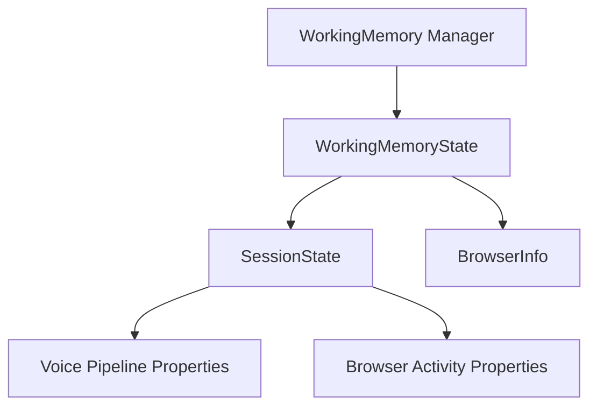

# Developer Documentation: Working Memory System

The Working Memory system manages Nova's short-term cognitive state, goals, and active runtime session information. This guide describes the architecture, field validations, voice loop hooks, and automatic browser state tracking mechanisms.

---

## 1. Architectural Overview

Working Memory consists of three layers:
1. **`WorkingMemory` (Manager)**: The public API provider (`get`, `set`, `remove`, `clear`, `snapshot`, `restore`, `append_history`).
2. **`WorkingMemoryState` (Structured Container)**: Holds task/goal context, dynamic variables, turn histories, and event logs.
3. **`SessionState` (Runtime Layer)**: Maintains the session lifecycle, active application references, voice metrics, and automated browser parameters.



---

## 2. Session State Schema

Below are the key session parameters tracked automatically:

### Voice Pipeline Properties
- `voice_session_state`: State of the voice service (`"active"`, `"inactive"`, `"idle"`).
- `listening_state`: Current listening phase (`"listening"`, `"idle"`).
- `wake_word_activation`: Boolean indicating if the wake word triggered the current turn.
- `recognition_confidence`: Fused STT/wake confidence score (float in `[0.0, 1.0]`).
- `current_speaker`: Profile verification status.
- `final_transcription`: Text output from speech-to-text.

### Browser Activity Properties
- `current_browser`: Browser engine identifier (`"Chromium"`).
- `current_tab`: Unique active tab hash value (e.g. `tab_1234`).
- `tab_title`: Title of the active tab.
- `current_url`: URL of the active page.
- `domain`: Domain name parsed from the active URL.
- `search_engine`: Identified search engine if on a query page (`"Google"`, `"Bing"`, `"Yahoo"`, `"DuckDuckGo"`).
- `current_search_query`: Extracted query parameters from search URLs.
- `navigation_history`: List of URLs visited in chronological order (excludes duplicate consecutive entries).
- `download_activity`: List of dictionaries recording file download metadata:
  ```json
  {
    "filename": "installer.dmg",
    "url": "https://example.com/installer.dmg",
    "timestamp": 1783012921.4
  }
  ```
- `open_tabs_count`: Integer representing the number of open tabs.

---

## 3. Automatic Browser State Tracking

Browser state tracking is event-driven and runs directly over Playwright's CDP remote debugging interface.

### Listeners registration
When `BrowserManager` establishes or retrieves a persistent context (`get_persistent_context`), it attaches the following listeners to avoid manual state polling:

- **Context-level events**:
  - `page`: Fired when a new tab/page popup is opened. It automatically registers page-level listeners on the new target.
  - `download`: Fired when a file download is initiated. Appends the event to `download_activity` if the exact file/url combination has not been recorded yet.
- **Page-level events**:
  - `framenavigated`: Fired when a page navigates to a new URL. Re-parses domains, updates titles, and appends to `navigation_history`.
  - `load`: Fired when page assets/document settles.
  - `close`: Fired when a page is closed. Decrements `open_tabs_count` and focuses the next best page.

```python
# Registrations in BrowserManager
context.on("page", lambda page: cls._attach_page_state_listeners(page))
context.on("download", lambda download: cls._handle_download(download))

page.on("framenavigated", lambda frame: cls.trigger_memory_update())
page.on("load", lambda p: cls.trigger_memory_update())
page.on("close", lambda p: cls.trigger_memory_update())
```

---

## 4. Voice Pipeline Integration

During the voice interaction state machine loop (`conversation.py`), the `VoiceLoopState` automatically updates Working Memory at specific pipeline stages:

1. **Activation**: On startup, sets `voice_session_state` to `"active"`.
2. **Turn Start**: Clears single-turn properties (`wake_word_activation`, `recognition_confidence`, `final_transcription`).
3. **Wake Verification**: Updates `wake_word_activation = True`, `listening_state = "listening"`, and stores the voice confidence and verified speaker profile.
4. **STT Completion**: Sets `final_transcription` and updates `listening_state = "idle"`.
5. **Deactivation**: Sets `voice_session_state` to `"inactive"` on loop exit.

---

## 5. Developer Guide: Dependency Injection

To use Working Memory in a new action or component:
1. Ensure the component receives the `WorkingMemory` instance at instantiation.
2. In the action dispatchers, the voice loop automatically binds the active memory context to all loaded action classes:
   ```python
   action.working_memory = state.working_memory
   ```
3. Read or write variables using structured keys:
   ```python
   # Set a custom variable (added to additional_properties)
   working_memory.set("custom_key", "value")
   
   # Retrieve a session parameter
   active_url = working_memory.get("current_url")
   ```
