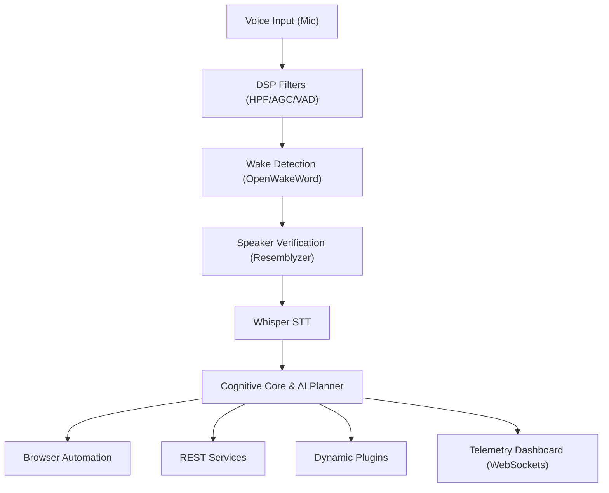

# Architecture Guide

This document describes the high-level cognitive architecture of the Nova assistant.

---

## Subsystem Design

### Subsystems Breakdown:
1.  **Voice Subsystem**: Handles capture and verification of the user's speech.
2.  **Browser Subsystem**: Operates Playwright Chromium processes headed/headless.
3.  **AI Planning Subsystem**: Breaks down goals into structured steps.
4.  **Dashboard Subsystem**: Telemetry event publishing.
