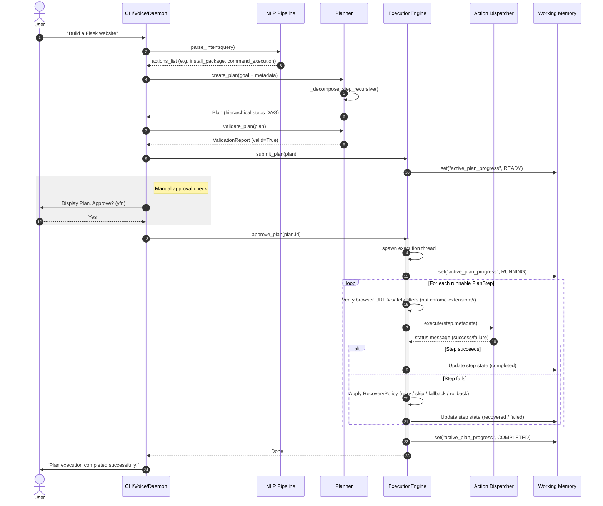
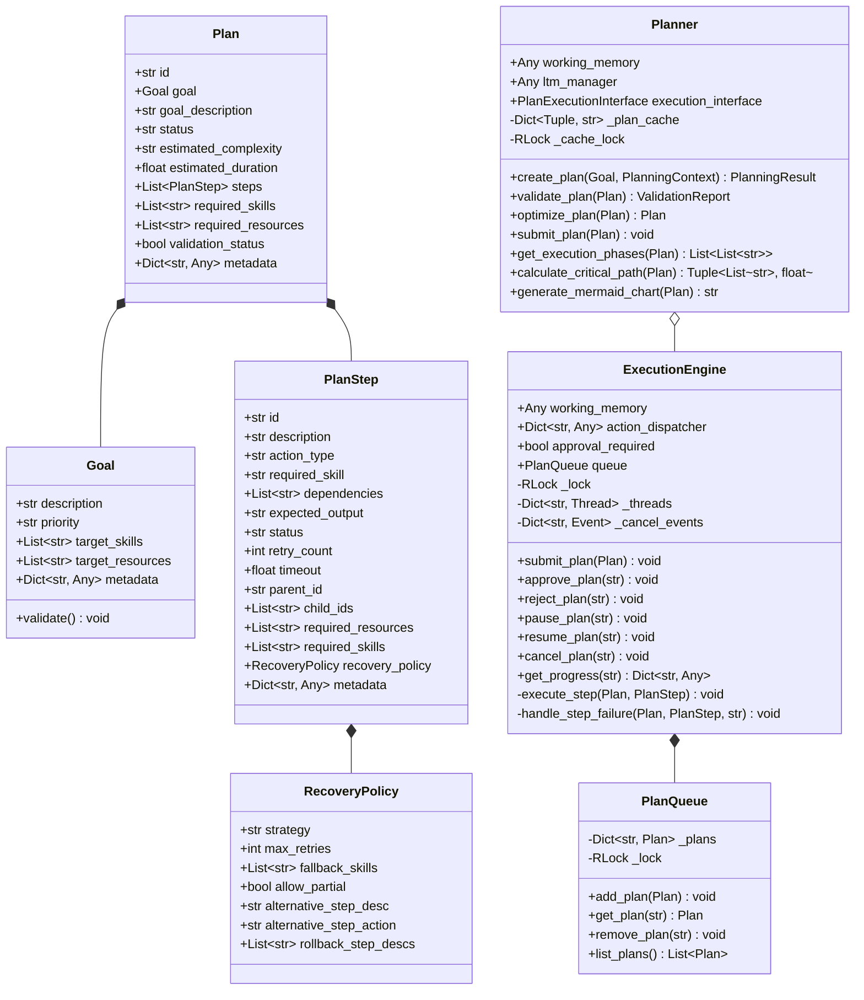

# Nova Planner Subsystem: Master Architecture & Integration Document

This document serves as the complete technical blueprint, developer manual, and integration roadmap for the **Nova Planner Subsystem** and **Execution Engine**.

---

## 1. Subsystem Architecture Document

### 1.1 Separation of Concerns & Executive Function
The Planner functions as the **executive planning subsystem** of Nova. It acts as a cognitive gateway, transforming high-level goals into structured, dependency-mapped plans of action *without triggering execution*. 

All execution operations are strictly delegated to the **Execution Engine** to maintain modularity, safety, and decoupling.

```
       User / CLI / Voice
               │
               ▼
         [NLP Pipeline]
               │
               ▼
      [Intent Parser (LLM)]
               │  Parsed actions list
               ▼
          [Planner] <----------------- [Long-Term Memory] (Read-Only)
               │  Goal / Steps DAG
               ▼
      [Plan Validation]
               │  Validated Plan Object
               ▼
      [Execution Engine] <------------ [Working Memory] (Read/Write)
               │
               ▼
        [Action Engine] (Dispatcher)
               │
               ▼
 [Browser / System / Files / Voice / Plugins]
```

- **The Planner**: Performs goal-oriented task decomposition, skill selection, resource mapping, validation, parallel partitioning, optimization, and critical path calculation. It reads from Working Memory and Long-Term Memory to enrich planning context (never mutating them). It semantically matches user queries against a database of 15 technology templates, verifies tool preconditions, dynamically inserts missing files/directories prerequisite steps, and maps dependencies using artifact producers and consumers instead of raw string matches.
- **The Execution Engine**: Manages the plan queue, manages execution states (`READY`, `VALIDATED`, `WAITING_APPROVAL`, `RUNNING`, `PAUSED`, `COMPLETED`, `FAILED`, `CANCELLED`), tracks step-by-step progress, validates browser window/tab safety, runs error recovery policies, and routes execution through the Action Engine dispatcher.

### 1.2 Goal-Oriented Planning System
To elevate planning intelligence, the Planner enforces a strict goal-oriented decomposition architecture:
1. **Semantic Template Matching**: Recognizes 15 tech templates (`Flask`, `FastAPI`, `React`, `Vue`, `Angular`, `Node.js`, `Express`, `Rust`, `C++`, `Java`, `Python CLI`, `Django`, `Static Website`, `Electron`, `Qt`) to infer deliverables, preconditions, dependencies, and risk analysis metrics.
2. **Strict 9-Phase Skeleton Hierarchy**: Every generated template plan is structured as a 2-level tree under a main Goal root, divided into 9 phases: `Project Setup`, `Environment Setup`, `Dependency Installation`, `Project Structure`, `Source Code Generation`, `Configuration`, `Validation`, `Execution`, and `Verification`.
3. **Precondition Check & Adaptation**: Before finalizing a plan, the Planner checks the availability of required system compiler/package manager tools (e.g. `g++`, `cargo`, `npm`) and files. If any required component is missing and not already scheduled for creation, it dynamically inserts file/directory generation steps into the plan structure.
4. **Artifact-Driven Dependencies**: Plan steps express dependencies via `required_artifacts` and `expected_artifact` fields. The Planner automatically links consumers to producers in the DAG, avoiding brittle step description matching.

### 1.3 Structured Action Model
To guarantee decoupling and safety, the Planner decomposes goals into steps carrying structured metadata rather than platform-specific shell scripts (e.g. `mkdir -p flask_project`).

Each `PlanStep` carries:
```python
{
    "action": "file_action",        # target Action Engine handler
    "params": {                     # parameters passed to the handler
        "operation": "create_directory",
        "path": "flask_project"
    }
}
```

#### Execution Routing Heuristics
When executing a step, the `ExecutionEngine` follows a strict routing priority:
1. **Priority 1: Structured Metadata Action**: Checks if `step.metadata["action"]` matches a registered Action Engine handler name (e.g., `file_action`). If so, execute it with `step.metadata["params"]`.
2. **Priority 2: Action Type Fallback**: Checks if `step.action_type` matches a registered Action Engine handler. If so, execute it with legacy parameters or parameters from metadata.
3. **Priority 3: Structured command_execution**: Runs command lists safely via subprocess (e.g., `["python", "-m", "venv", ".venv"]`).
4. **No Raw Fallback**: The engine never executes step descriptions or arbitrary step titles as raw shell commands. Steps failing to resolve to a structured action fail execution.

### 1.3 Dependency Injection Model
To avoid global variables and improve testing isolation, memory modules and action dispatchers are passed via **Constructor Dependency Injection**:
```python
class Planner:
    def __init__(
        self,
        working_memory: Optional[Any] = None,
        ltm_manager: Optional[Any] = None,
        execution_interface: Optional[PlanExecutionInterface] = None
    ) -> None:
        ...

class ExecutionEngine:
    def __init__(
        self,
        working_memory: Optional[Any] = None,
        action_dispatcher: Optional[Dict[str, Any]] = None,
        approval_required: bool = True
    ) -> None:
        ...
```

---

## 2. Developer Guide & Conventions

### 2.1 Code Conventions
- **Immutability of Inputs**: When generating plans, never mutate the incoming `Goal` or memory states.
- **Strict Typing**: All dataclasses, functions, and methods utilize PEP 484 type annotations.
- **UUID Uniqueness**: Every plan and plan step must carry unique IDs. When plans are loaded from the cache, step and plan IDs must be re-mapped to avoid overlap collisions.

### 2.2 Core Dataclasses
- `Goal`: Represents the desired end state.
- `RecoveryPolicy`: Configuration rules for managing failed steps.
- `PlanStep`: Represents a single executable action or composite node.
- `Plan`: The DAG container carrying steps, dependencies, constraints, and latency estimates.

### 2.3 Subsystem Execution State Machine
A plan moves through the following state configurations:
```
           ┌─────────────┐
           │  VALIDATED  │
           └──────┬──────┘
                  │
                  ▼
         ┌──────────────────┐
         │ WAITING_APPROVAL │
         └────────┬─────────┘
                  │  (User Approval)
                  ▼
           ┌─────────────┐
           │    READY    │
           └──────┬──────┘
                  │  (Start / Run)
                  ▼
           ┌─────────────┐  pause_plan()   ┌─────────────┐
           │   RUNNING   │ <-------------> │   PAUSED    │
           └──────┬──────┘  resume_plan()  └──────┬──────┘
                  │                               │
                  ├──────────────┬────────────────┤ cancel_plan()
                  ▼              ▼                ▼
           ┌─────────────┐┌─────────────┐  ┌─────────────┐
           │  COMPLETED  ││   FAILED    │  │  CANCELLED  │
           └─────────────┘└─────────────┘  └─────────────┘
```

---

## 3. Sequence & Class Diagrams

### 3.1 Sequence Diagram: Request to Execution Flow



### 3.2 UML Diagram & Class Relationships



---

## 4. Detailed Planning Lifecycle

```
[Goal Definition]
       │
       ▼
[Goal Validation] (Verify description and priority limits)
       │
       ▼
[Context Enrichment] (Read preferences from WM and LTM)
       │
       ▼
[Decomposition Route] (Match static DECOMPOSITION_RULES, else build steps from NLP actions)
       │
       ▼
[Skill Selection & Resource Mapping] (Identify step skills/resources)
       │
       ▼
[Dependency Propagation] (Connect exit leaves of A to entry leaves of B)
       │
       ▼
[Plan Optimization] (Merge duplicate steps, topologically sort DAG)
       │
       ▼
[Validation Subsystem] (Check constraints, circles, resources, timeouts)
       │
       ▼
[Plan Serialization & Caching] (Write validated plan to Cache)
       │
       ▼
[Submission to Queue] (Submit plan to ExecutionEngine queue in WAITING_APPROVAL or READY state)
```

---

## 5. Thread Safety Design

1. **Reentrant Cache Locks**: `Planner._cache_lock = threading.RLock()` protects lookups and updates on the plan cache. This eliminates data corruption issues if multiple background agent loops request plans concurrently.
2. **Reentrant State Locks**: `ExecutionEngine._lock = threading.RLock()` and `PlanQueue._lock = threading.RLock()` wrap all queue mutations, step status updates, progress telemetry calculations, thread tracking, and execution cancellation flags. This guarantees thread-safe, atomic execution state changes.

---

## 6. Future Integration Guide

### 6.1 Reasoning Engine Integration
The **Reasoning Engine** (e.g. Chain of Thought / LLM modules) can be integrated to handle decomposition when no matching static rules are found in `DECOMPOSITION_RULES`:
- **Interface**: Define a fallback method:
  `self.reasoning_engine.decompose_goal(description: str, context: Dict[str, Any]) -> List[Dict[str, Any]]`
- **Fallback Rule Integration**: If `DECOMPOSITION_RULES` has no matching key, trigger the Reasoning Engine to dynamically synthesize the sub-step schemas.

### 6.2 Reflection Engine Integration
The **Reflection Engine** operates as an audit loop checking completed, failed, or partially completed plans:
- **Interface**: Provide execution timeline logs to the reflection loop:
  `self.reflection_engine.audit_timeline(plan.metadata["execution_timeline"])`
- **Dynamic Corrections**: If the reflection loop identifies repeated failure patterns, it can rewrite step parameters or adjust `RecoveryPolicy` thresholds for future goals.

### 6.3 Goal Manager Integration
The **Goal Manager** acts as the high-level task queue, submitting goals based on conversation intents:
- **Interface**: The Goal Manager calls `Planner.create_plan(goal)` to check feasibility before committing a task to the execution scheduler.
- **Priority Scheduling**: The Goal Manager inspects `Plan.estimated_duration` and `Plan.estimated_complexity` to schedule tasks based on system resources.

### 6.4 Skill Registry Integration
Rather than using static keyword searches inside `determine_required_skills`, the Planner should query a dynamic **Skill Registry**:
- **Interface**: Query registered skills:
  `skills = self.skill_registry.match_skills(step_description, action_type)`
- **Benefit**: Allows plugins and custom user actions to dynamically register new capabilities that the Planner can automatically assign to step tasks.

### 6.5 Experience Learning Subsystem
The **Experience Learning** subsystem gathers telemetry details from plan validations and execution histories to tune planning heuristics:
- **Duration Tuning**: Learns actual execution step latencies to adjust steps' `timeout` weights.
- **Recovery Policy Tuning**: Learns recovery success ratios to automatically promote successful strategies (e.g. swapping browser inputs to shell operations) over failed retries.
