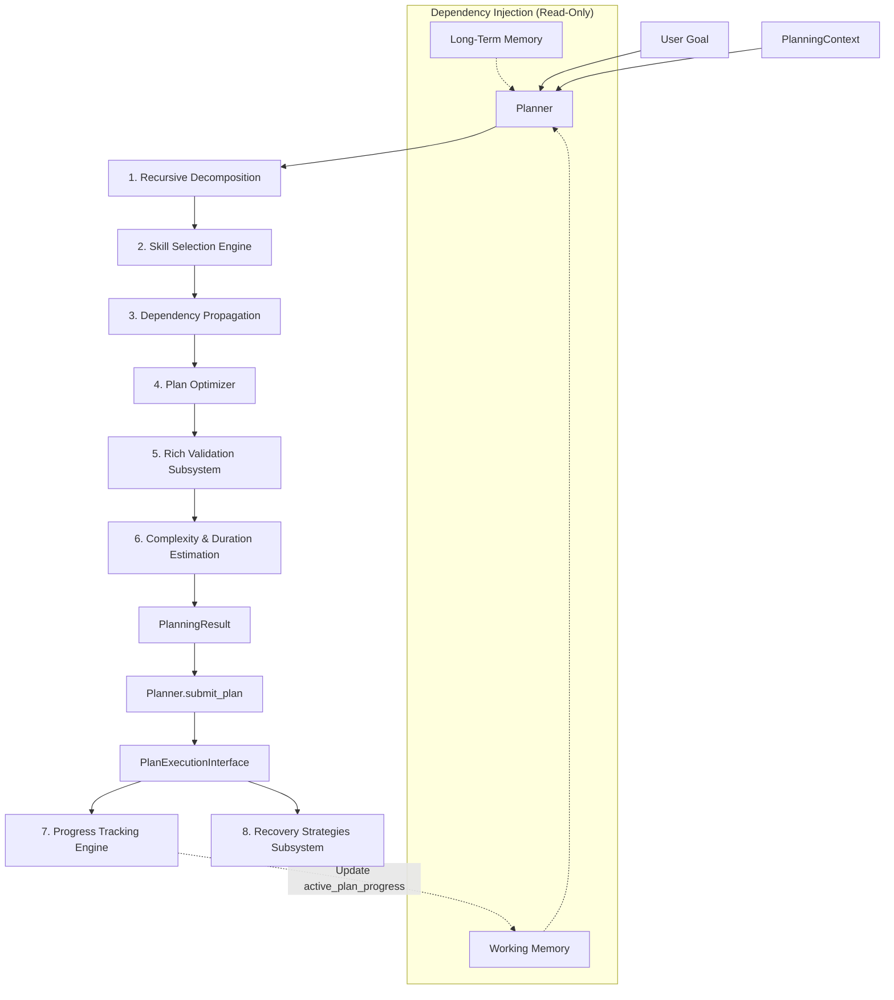
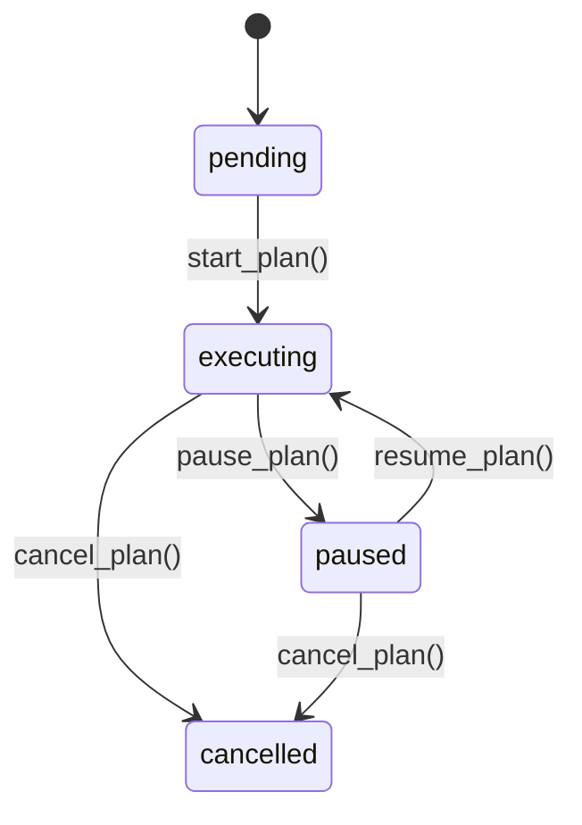

# Nova Planner Subsystem Developer Documentation

The **Planner Subsystem** acts as the executive function of the Nova AI Assistant. It transforms high-level user goals into structured, dependency-mapped execution plans without executing them.

---

## 1. Architectural Overview

The Planner is built as an independent, decoupled module designed with object-oriented principles, avoiding global state and using dependency injection for memory integration.



### Key Principles
1. **Separation of Concerns**: The Planner focuses purely on plan synthesis, graph validation, and parameter estimation. It contains no execution logic.
2. **Read-Only Memory Access**: The Planner can read from Working Memory and Long-Term Memory (via injected managers) to customize steps based on active context or user preferences, but it is strictly forbidden from mutating memory.
3. **Recursive Task Decomposition**: Large user goals are recursively decomposed into sub-tasks and sub-goals until executable leaf steps are produced, building a parent-child relationship hierarchy.
4. **Hierarchical Cycle and Graph Validation**: The plan is verified for structural integrity, ensuring that no cycles exist in parent-child lineages or sequential dependencies.
5. **DAG Phasing & Analytics**: Leaf steps are partitioned into parallel execution phases, and the critical path determines the minimum possible duration using CPM.
6. **Automated Skill Selection**: Each step is automatically mapped to one or more system skills (e.g. Browser, GitHub, System, OCR, Voice) using the Skill Selection engine.
7. **Rich Validation Reporting**: Integrates a plan validation engine that compiles detailed error logs, warning logs, and execution metric reports.
8. **Execution Submission Abstraction**: Connects to the Action Engine using an abstraction interface (`PlanExecutionInterface`) that manages plan lifecycles and states.
9. **Progress Tracking**: Tracks running, completed, waiting, skipped, and failed steps, remaining duration estimations, completion percentages, chronological execution timelines, and integrates directly with Working Memory.
10. **Recovery Subsystem**: Configures failure policies per step to apply fallback skills, retries, rollbacks, alternate paths, skips, or tolerance allowances.
11. **Plan Optimizer**: Dedupes duplicate leaf steps and topologically sorts the final DAG for optimal execution ordering.
12. **In-Memory Plan Caching**: Speeds up recurring goals by caching validated plan templates and remapping UUIDs dynamically to bypass decomposition overhead.

---

## 2. Core Data Models

The Planner defines the following Python dataclasses:

### `Goal`
Represents the user's high-level objective.
- `description` (`str`): Text description of the goal.
- `priority` (`str`): Importance level (`"low"`, `"medium"`, or `"high"`).
- `target_skills` (`List[str]`): Pre-identified list of skills required.
- `target_resources` (`List[str]`): List of resource identifiers.
- **Methods**:
  - `validate()`: Raises `ValueError` if the description is empty or priority is invalid.

### `RecoveryPolicy`
Defines error-recovery procedures for a step:
- `strategy` (`str`): Recovery mechanism (`"retry"`, `"skip"`, `"alternative_step"`, `"fallback_skill"`, `"rollback"`, `"partial_completion"`).
- `max_retries` (`int`): Maximum attempt count for `"retry"`.
- `fallback_skills` (`List[str]`): Swapped capabilities list for `"fallback_skill"`.
- `allow_partial` (`bool`): Tolerance flag for `"partial_completion"`.
- `alternative_step_desc` (`Optional[str]`): Swapped description for `"alternative_step"`.
- `alternative_step_action` (`Optional[str]`): Swapped action type for `"alternative_step"`.
- `rollback_step_descs` (`List[str]`): Step descriptors list for `"rollback"`.

### `PlanStep`
A single task step inside a hierarchy.
- `id` (`str`): Unique UUID.
- `description` (`str`): Human-readable task instruction.
- `action_type` (`str`): Target execution action type.
- `required_skill` (`str`): Legacy primary skill needed (e.g., `browser`, `shell`, `git`).
- `dependencies` (`List[str]`): List of `PlanStep` IDs that must be completed before this step runs.
- `expected_output` (`str`): Expected result of the step.
- `status` (`str`): Run state (`"pending"`, `"executing"`, `"paused"`, `"cancelled"`, `"completed"`, `"failed"`, `"skipped"`).
- `retry_count` (`int`): Maximum execution retry attempts.
- `timeout` (`float`): Execution timeout in seconds.
- `metadata` (`Dict[str, Any]`): Dynamic step metadata.
- `parent_id` (`Optional[str]`): Reference to the parent step's UUID if this is a sub-step.
- `child_ids` (`List[str]`): Reference to children steps' UUIDs if this is a composite step.
- `required_resources` (`List[str]`): List of specific system resources required by the step (e.g. `network`, `terminal`).
- `required_skills` (`List[str]`): List of required skills selected automatically by the Planner.
- `recovery_policy` (`Optional[RecoveryPolicy]`): Step level failure recovery configuration.

### `Plan`
The structured set of steps designed to fulfill a `Goal`.
- `id` (`str`): Unique UUID.
- `goal` (`Goal`): The initiating `Goal` object.
- `goal_description` (`str`): Description of the goal.
- `priority` (`str`): Plan priority level.
- `status` (`str`): Overall state (`"pending"`, `"validated"`, `"executed"`, `"failed"`, `"cancelled"`, `"executing"`, `"paused"`).
- `estimated_complexity` (`str`): Estimated cognitive/computational effort (`"low"`, `"medium"`, `"high"`).
- `estimated_duration` (`float`): Estimated execution duration in seconds.
- `creation_timestamp` (`float`): Creation epoch timestamp.
- `created_at` (`float`): Legacy epoch timestamp alias.
- `dependencies` (`List[str]`): High-level dependencies.
- `steps` (`List[PlanStep]`): Flat list containing all composite and leaf steps in the hierarchy.
- `required_skills` (`List[str]`): Deduped skills required across all steps.
- `required_resources` (`List[str]`): Combined resource requirements.
- `validation_status` (`bool`): `True` if validation succeeded.
- `metadata` (`Dict[str, Any]`): Dynamic plan metadata.

### `PlanProgress`
Encapsulates real-time execution statistics for a plan:
- `completed_steps` (`List[str]`): Mapped step UUIDs that completed successfully.
- `failed_steps` (`List[str]`): Step UUIDs that failed.
- `running_steps` (`List[str]`): Step UUIDs currently executing.
- `waiting_steps` (`List[str]`): Step UUIDs pending or paused.
- `skipped_steps` (`List[str]`): Step UUIDs skipped.
- `completion_percentage` (`float`): Leaf step completion percentage (including skipped leaves).
- `estimated_remaining_time` (`float`): Sum of timeouts of leaf steps that are pending, executing, or paused.
- `execution_timeline` (`List[Dict[str, Any]]`): Chronological state transition logs.

---

## 3. Plan Optimization Subsystem

### 1. In-Memory Plan Caching
Recurring goals are optimized using `self._plan_cache` to cache validated plans:
- **Key**: `(goal.description.strip().lower(), goal.priority)`
- **Value**: Serialized JSON representation of the validated `Plan`.
- **Re-mapping UUIDs**: On a cache hit, the Planner automatically re-maps the plan ID and all step IDs (including parent-child associations and dependency links) to fresh UUIDs to prevent collision conflicts within `PlanExecutionManager`. This drops recurring planning latency down to $~0.1$ ms.

### 2. Duplicate Step Merger
`optimize_plan(plan)` merges duplicate leaf steps under the same parent scope:
- Steps are matched by `description`, `action_type`, and `parent_id`.
- Duplicate steps are removed, merging resources, required skills, and dependency requirements into the primary step.
- Downstream steps' dependencies pointing to duplicates are automatically redirected.

### 3. Topological Sort
The plan steps list is topologically sorted based on step dependency graphs to ensure execution phase correctness.

---

## 4. Plan Validation Subsystem

The Plan Validation subsystem checks plans against safety, correctness, and feasibility criteria:

### 1. `ValidationReport` API
The validation method (`validate_plan`) returns a detailed `ValidationReport` containing:
- `valid` (`bool`): `True` if no critical errors were found.
- `errors` (`List[str]`): Hard blocking errors preventing execution.
- `warnings` (`List[str]`): Quality warnings that do not block validation but flag potential issues.
- `metrics` (`Dict[str, Any]`): Quantitative audit statistics (e.g. total steps, leaf steps count, list of skills and resources used).

*Backward Compatibility*: `ValidationReport` supports unpacking like a standard python tuple (`valid, errors = planner.validate_plan(plan)`) to maintain backwards compatibility with legacy callers.

### 2. Validation Rules

- **Dependency Correctness**:
  - Checks if every dependency step ID points to an existing step in the plan.
  - Detects self-dependencies (a step depending on itself).
  - Flags impossible structural dependency dependencies (e.g. a parent depending on its own child).
- **Circular Dependencies**: Checks for loops in sequential step dependencies using DFS tracking.
- **Hierarchy Cycles**: Traces parent steps to ensure no step is its own ancestor.
- **Duplicate Steps**: Checks for duplicate step UUIDs (error) and matching descriptions/types within the same scope (warning).
- **Missing Skills**: Compares required step skills against allowed skills:
  - `ALLOWED_SKILLS = {"browser", "voice", "github", "weather", "files", "adb", "ocr", "email", "system", "music", "generic", "shell", "file_manager", "git", "chromium_action", "git_action", "command_execution", "generic_action"}`
  - Unrecognized skills generate a validation warning.
- **Invalid Resources**: Verifies resources against recognized system tokens:
  - `ALLOWED_RESOURCES = {"network", "browser_session", "terminal", "audio_device"}`
  - Unrecognized resources generate a critical validation error.
- **Timeout Feasibility**:
  - Flags steps with non-positive timeouts (error).
  - Flags steps with individual timeouts exceeding 300 seconds (error).
  - Flags plans with cumulative leaf step timeouts exceeding 1800 seconds (error).
- **Impossible Plans**: Flags plans with zero steps.

---

## 5. Execution Interface & State Machine

The interface between the Planner and Nova's Action Engine is governed by `PlanExecutionInterface` to control execution flows dynamically without executing underlying physical tasks.

### 1. `PlanExecutionInterface`
An Abstract Base Class (ABC) defining step control signatures:
- `start_plan(plan: Plan) -> None`
- `pause_plan(plan_id: str) -> None`
- `resume_plan(plan_id: str) -> None`
- `cancel_plan(plan_id: str) -> None`
- `get_status(plan_id: str) -> str`

### 2. `PlanExecutionManager`
The concrete implementation of `PlanExecutionInterface` that tracks actively managed plans and coordinates step status transitions:



- **`start_plan`**: Moves plan status to `"executing"` and transitions any initial execution steps (those without dependencies) from `"pending"` to `"executing"`.
- **`pause_plan`**: Moves plan status to `"paused"` and updates all currently `"executing"` steps to `"paused"`.
- **`resume_plan`**: Moves plan status to `"executing"` and transitions all `"paused"` steps back to `"executing"`.
- **`cancel_plan`**: Moves plan status to `"cancelled"` and flags all active steps (`pending`, `executing`, `paused`) as `"cancelled"`.

---

## 6. Progress Tracking Subsystem

The progress tracker operates inside `PlanExecutionManager` to trace plan executions:

### 1. Chronological Timeline Recording
Transitions are logged in `plan.metadata["execution_timeline"]` as dictionaries:
```python
{
    "step_id": step_id,
    "description": step_desc,
    "status": new_status,
    "timestamp": float
}
```

### 2. Statistics Calculation
Calling `get_progress(plan_id)` returns a `PlanProgress` object:
- **Completion Percentage**: Completed and skipped leaf steps divided by total leaf steps:
  $$\text{Percentage} = \frac{\text{Completed Leaves} + \text{Skipped Leaves}}{\text{Total Leaves}} \times 100$$
- **Remaining Time**: Sum of timeouts of leaf steps in non-terminal states (`pending`, `executing`, `paused`). Terminal statuses (`completed`, `failed`, `skipped`, `cancelled`) are excluded.

### 3. Working Memory Integration
Whenever a state transition occurs (plan starts, pauses, resumes, cancels, or a step is modified via `update_step_status()`), the manager compiles the progress details and writes them to Working Memory:
```python
self.working_memory.set("active_plan_progress", asdict(progress))
```

---

## 7. Failure Recovery Subsystem

When a step fails, `PlanExecutionManager.prepare_recovery_plan(plan_id, failed_step_id)` processes mutations on the plan steps according to the configured `RecoveryPolicy`:

1. **`retry`**:
   - If `retry_count > 0`, it decrements the step's retry counter and resets status back to `"pending"`.
   - If retries are exhausted, it marks the plan status as `"failed"`.
2. **`skip`**:
   - Transitions the failed step to `"skipped"` status, allowing the plan execution flow to move forward.
3. **`alternative_step`**:
   - Injects a new `PlanStep` definition (using the policy's description and action configuration) into `plan.steps`.
   - Copy-propagates all dependency steps from the failed step to the new alternative step.
   - Redirects all parent child lists and downstream dependency arrows from the failed step to the new alternative step.
   - Marks the original failed step as `"skipped"`.
4. **`fallback_skill`**:
   - Re-allocates the step's capabilities to the fallback list and transitions status back to `"pending"` for re-processing.
5. **`rollback`**:
   - Appends rollback steps (cleanup commands) onto the plan's list.
   - Marks overall plan status as `"failed"`.
6. **`partial_completion`**:
   - If `allow_partial` is `True`, it skips the failed step and keeps plan status as `"executing"`, allowing other unrelated task branches to run.

---

## 8. Recursive Task Decomposition

The Planner uses a predefined list of keyword-based rules (`DECOMPOSITION_RULES`) to split goals into smaller tasks.

### Flow Example: "Build a Flask website"

```
Build a Flask website (Root Goal)
 ├── Project Setup (Parent)
 │    ├── Create Folder (Leaf) [skills: files, system]
 │    ├── Create Virtual Environment (Leaf) [skills: system; depends on Create Folder]
 │    └── Install Flask (Leaf) [skills: system; depends on Create Virtual Environment]
 ├── App Development (Parent) [depends on Project Setup]
 │    └── Generate Files (Leaf) [skills: files; depends on Install Flask via propagation]
 └── Execution (Parent) [depends on App Development]
      └── Run Server (Leaf) [skills: system; depends on Generate Files via propagation]
```

### Dependency Propagation Algorithm
If parent step $A$ depends on parent step $B$, the dependency is automatically propagated to the executable leaf nodes:
1. **Entry Leaves** of a step S are leaf descendants of S that do not depend on any sibling step.
2. **Exit Leaves** of S are leaf descendants of S that no other sibling step depends on.
3. The Planner hooks all Entry Leaves of $A$ to depend on all Exit Leaves of $B$. This results in a continuous, topologically valid chain of executable steps.

---

## 9. Skill Selection Engine

The Skill Selection engine (`determine_required_skills`) inspects step descriptions and action types against mapped skill keywords to assign appropriate capabilities to each `PlanStep`:

- **`browser`**: browser, chrome, chromium, navigate, website, youtube, url, tab, web
- **`voice`**: voice, speech, transcribe, speak, tts, mic, whisper, sound
- **`github`**: git, github, repository, commit, push, pull, repo, clone
- **`weather`**: weather, forecast, temperature, rain, sunny, wind
- **`files`**: file, folder, directory, mkdir, path, generate files, create folder, templates
- **`adb`**: adb, android, phone, apk, device
- **`ocr`**: ocr, extract text, screen ocr, read screen
- **`email`**: email, mail, gmail, send email, inbox
- **`system`**: system, shell, command, script, running, specs, volume, brightness, control, screenshot
- **`music`**: music, song, audio player, spotify, soundtrack

If a step combines multiple activities (e.g. `"screenshot and extract text using OCR"`), it will be assigned multiple matching skills (e.g., `["system", "ocr"]`).

---

## 10. Advanced DAG Analytics

The Planner provides analysis features to assess performance:

### 1. Parallel Phasing
Using topological partitioning (`get_execution_phases(plan)`), leaf steps are grouped into sequential levels. Steps in the same level do not depend on each other and can run in parallel:
- **Phase 0**: Leaf steps with no dependencies.
- **Phase N**: Leaf steps whose dependencies are all satisfied in levels $< N$.

### 2. Critical Path Calculation
The Critical Path Method (`calculate_critical_path(plan)`) calculates the longest sequence of dependent leaf tasks, which dictates the minimum possible runtime. This is solved in linear time $O(V + E)$ using topological dynamic programming on the DAG where step `timeout` serves as the weight.

### 3. Mermaid Visualization
`generate_mermaid_chart(plan)` outputs a flowchart diagram representing parent-child subgraphs (using `subgraph` blocks) and execution dependency lines.

---

## 11. Planning Lifecycle

1. **Goal Validation**: The input `Goal` description and priority are checked.
2. **Context Retrieval**:
   - Extraction of context from Working Memory (`current_task`, `previous_command`, etc.).
   - Querying Long-Term Memory for user preferences (e.g. `preferred_browser`, `preferred_editor`).
3. **Hierarchical Task Breakdown**:
   - `_decompose_step_recursive()` splits rules until leaf nodes are reached.
   - Injecting memory context to dynamically overwrite leaf-level descriptions (e.g. customized browser names or specific test command scripts).
4. **Automated Skill Selection**: Queries the Skill Selection engine to tag required skills per step.
5. **Dependency Propagation**: Translates high-level structural constraints into step-level dependency links.
6. **Cycle Detection**:
   - Runs validation checks on sequential dependency loops.
   - Traces hierarchy paths to guarantee that no node is its own ancestor.
7. **Complexity & Duration Estimation**:
   - Complexity is mapped to low, medium, or high using hierarchy depth and step count.
   - Duration is calculated by summing timeouts of leaf steps only (avoiding double counting composite parents).

---

## 12. Class Interface

```python
class Planner:
    def __init__(
        self,
        working_memory: Optional[Any] = None,
        ltm_manager: Optional[Any] = None,
        execution_interface: Optional[PlanExecutionInterface] = None
    ) -> None:
        """Initializes the Planner with memory and execution dependencies."""
        
    def create_plan(
        self,
        goal: Goal,
        context: Optional[PlanningContext] = None
    ) -> PlanningResult:
        """Translates a Goal and PlanningContext into a validated Plan."""

    def validate_plan(self, plan: Plan) -> ValidationReport:
        """Ensures dependency graph validity, hierarchy acyclicity, and dependency checks."""

    def submit_plan(self, plan: Plan) -> None:
        """Submits a validated plan to the registered execution interface."""

    def get_execution_phases(self, plan: Plan) -> List[List[str]]:
        """Partitions leaf steps into sequential levels of parallelizable tasks."""

    def calculate_critical_path(self, plan: Plan) -> Tuple[List[str], float]:
        """Identifies the longest sequence of dependent tasks using dynamic programming."""

    def generate_mermaid_chart(self, plan: Plan) -> str:
        """Generates a Mermaid JS flowchart representation of the plan graph."""

    def determine_required_skills(self, description: str, action_type: str) -> List[str]:
        """Maps step descriptors to required system capabilities."""
```
